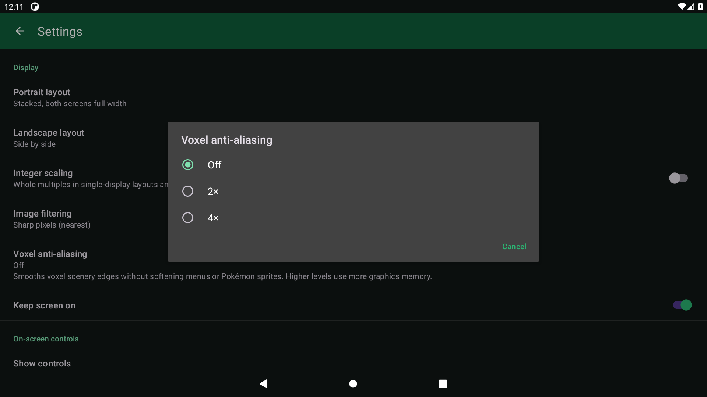
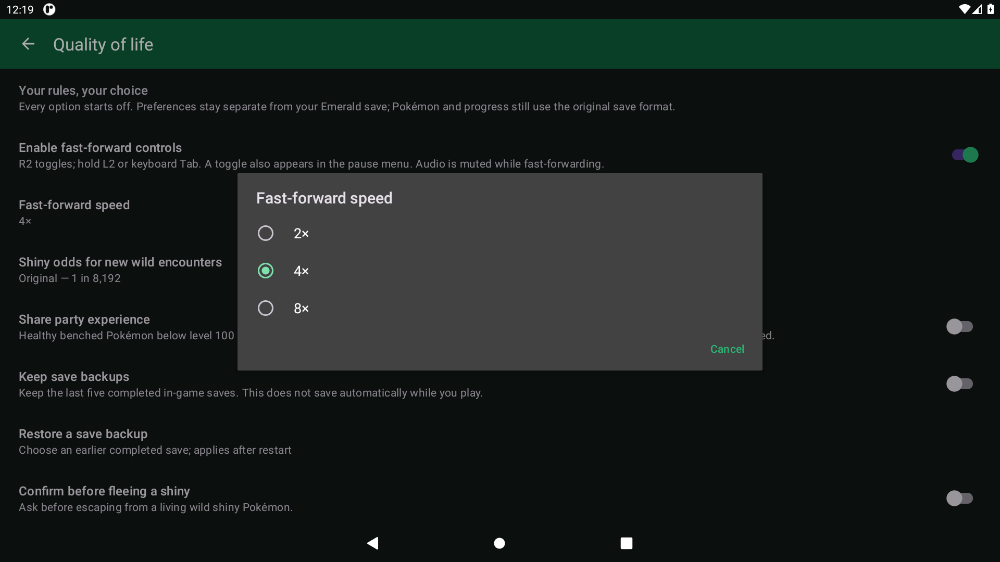
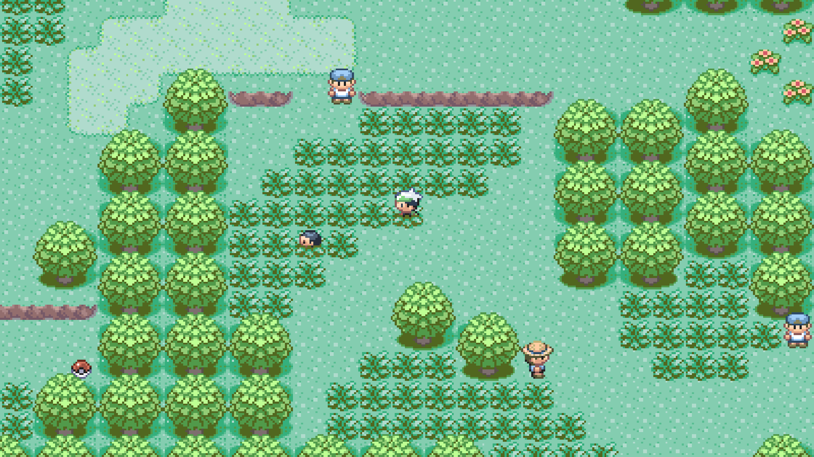
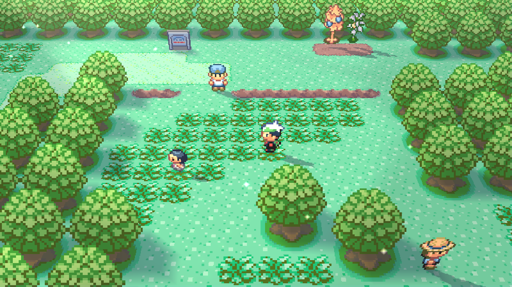
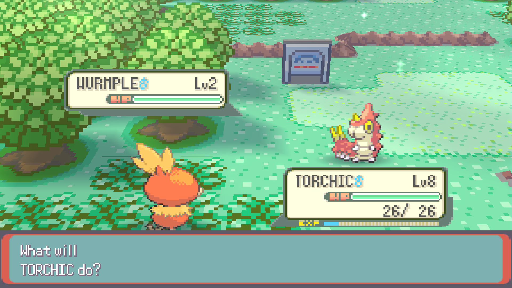
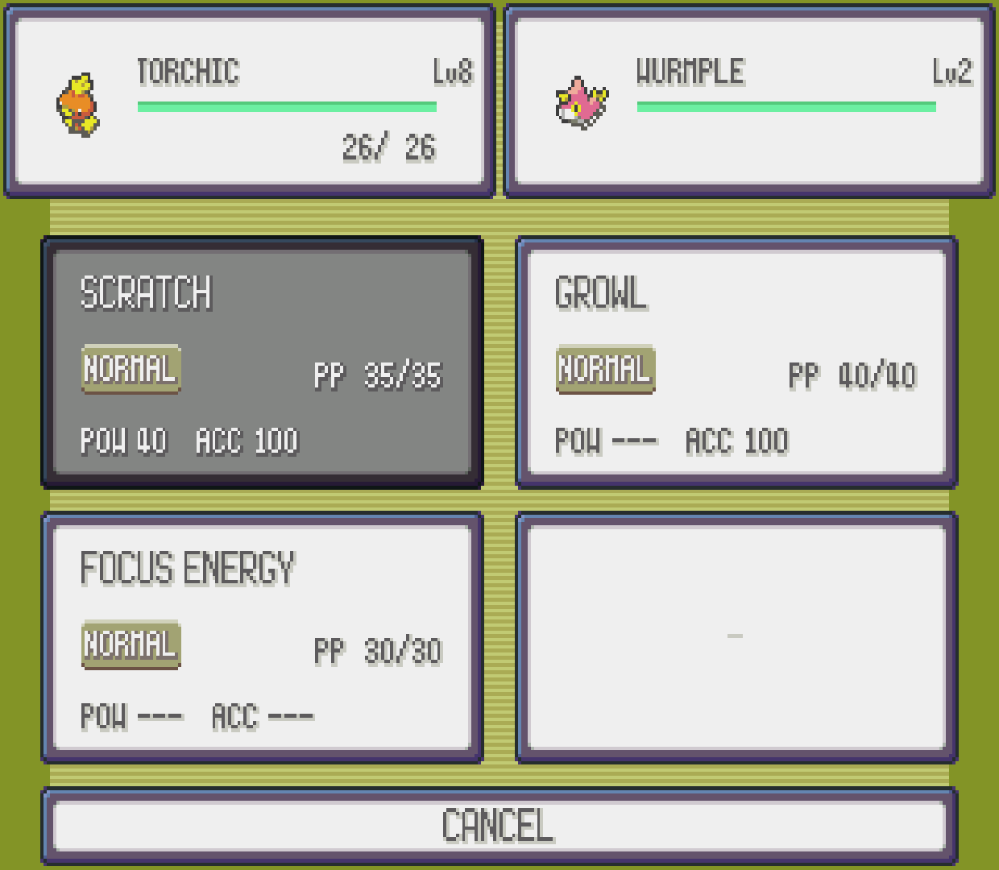

  

<h1 align="center">Pokémon Emerald Dual Screen</h1>

<strong>Emerald on Android. Built for two screens.</strong>

  Explore Hoenn on your AYN Thor, with the adventure above and touch menus below. 
  Classic 2D, optional voxel scenery, and layouts for compatible Android phones and handhelds.

  
  
  

  <a href="https://github.com/psspssr/pokeemerald-3Ds-dualscreen-thor/releases/tag/v0.1.0-beta.2">Download Android beta</a> ·
  <a href="https://psspssr.github.io/emerald-dual-screen-site/">Website</a> ·
  <a href="#get-started">Get started</a> ·
  <a href="#controls">Controls</a> ·
  <a href="docs/AYN_THOR.md">Thor setup</a>

  
   <em>Illustrative device mockup.</em>

An Android port of [ZallaxDev's Pokémon Emerald 3Ds Dual Screen](https://github.com/ZallaxDev/pokeemerald-3Ds-dualscreen), built on [pret/pokeemerald](https://github.com/pret/pokeemerald).

## Get started

Download the signed **[0.1.0-beta.2 Android beta](https://github.com/psspssr/pokeemerald-3Ds-dualscreen-thor/releases/tag/v0.1.0-beta.2)** and install its ARMv7 APK. Matching game data is included.

**Press L1 + R1 together** or keyboard **Escape** for Pause and Settings. Both Thor panels fill by default; choose **Fit** to preserve the original proportions. Phone layouts include on-screen controls. [Thor setup](docs/AYN_THOR.md).

Bring your progress through **Settings → Import save / Export save**. Standard Emerald GBA and emulator `.sav` files are supported; save states are not. Restart after importing and save normally in-game. Export your save before replacing a development APK, which uses a different signing key. [Save details](docs/BUILDING.md#engine-only-build-and-data-packs).

**Sharp pixels are the default**, including Pokémon sprites and battle text. Settings → Display offers **1×–4× voxel resolution**, starting at **2× Sharp** for new settings. Choose 1× for lighter rendering or 3×/4× for more detail; optional anti-aliasing smooths voxel edges. Existing quality choices are preserved. Enable voxel scenery and battles in **OPTION**; set **3D BLUR → OFF** if an older setup still looks soft. **SHOW FPS** starts off. [Display options](docs/AYN_THOR.md#game-graphics-and-summary-menus).

## Compatibility

Requires **Android 9+, OpenGL ES 3.0 and 32-bit ARM app support** (`armeabi-v7a`). Firmware limited to 64-bit apps cannot run this build. Tested in Android emulators; **full physical Thor validation and sustained performance testing remain open**. [Test results and limits](docs/VALIDATION.md).

## Controls

Face buttons use Nintendo positions by default, regardless of their printed labels.

| Action | Controller | Keyboard |
|---|---|---|
| Move | D-pad / left stick | Arrow keys |
| A / B | Right / bottom face button | X / Z |
| X / Y | Top / left face button | S / A |
| L / R | L1 / R1 individually | Q / W |
| Start / Select | Start / Select | Enter / Backspace or Shift |
| App pause menu | **L1 + R1 together** | Escape |
| Fast-forward toggle / hold | R2 / L2 | Tab: hold |

Fast-forward requires enabling it and choosing **2×, 4× or 8×** in Settings. Touch the bottom screen for game menus. [Full controls sheet, display swapping and optional controls](docs/AYN_THOR.md#controls-and-shortcuts).

## Optional extras

**Settings → Gameplay → Quality of life** offers fast-forward, shared party EXP, five rotating save backups and shiny-escape confirmation. Five shiny-odds choices range from **Original (1 in 8,192)** to **1 in 128**. All extras start off. [Options and odds details](docs/QUALITY_OF_LIFE.md).

**Settings → Gameplay → Mystery events** offers event-island tickets, offline Jirachi/Celebi gifts and missing Regi dolls. Activate each separately, then save in-game; normal story requirements remain. [Events and prerequisites](docs/MYSTERY_EVENTS.md).

  
See the optional settings

  

    
    
  

  

    
    
  

## See it in action

<table>
  <tr>
    <td width="50%"></td>
    <td width="50%"></td>
  </tr>
  <tr>
    <td align="center"><strong>The original 2D look</strong></td>
    <td align="center"><strong>Sharper voxel scenery</strong></td>
  </tr>
  <tr>
    <td width="50%"></td>
    <td width="50%"></td>
  </tr>
  <tr>
    <td align="center"><strong>Battles in the overworld</strong></td>
    <td align="center"><strong>Touch battle commands</strong></td>
  </tr>
</table>

Actual Android emulator captures at Thor panel sizes. [4× Ultra detail](docs/images/voxel-ultra-4x.png) · [Touch naming keyboard](docs/images/thor-touch-keyboard.png) · [Phone layout](docs/images/portrait-controls.png) · [Screenshot notes](docs/images/README.md).

## Project guides

[Build and test](docs/BUILDING.md) · [Thor setup](docs/AYN_THOR.md) · [Validation](docs/VALIDATION.md) · [Upstream updates](docs/UPDATING_FROM_ORIGIN.md)

[Automatic releases](docs/RELEASING.md) · [Architecture](docs/ANDROID_ARCHITECTURE.md)

## Credits and licensing

- **ZallaxDev and contributors** — [Pokémon Emerald 3Ds Dual Screen](https://github.com/ZallaxDev/pokeemerald-3Ds-dualscreen), the upstream game port and touch interface. [Support the original project](https://ko-fi.com/zallax) · [Community](https://discord.com/invite/tfqHF8496P).
- **pret** — [pokeemerald](https://github.com/pret/pokeemerald), the Emerald decompilation used by the upstream engine.
- **gradenGnostic/pokeemerald-multiplatform contributors** — voxel logic adapted by the 3DS project; see its [attribution](origin/3ds_port/src/voxel/NOTICE.md).
- **devkitPro** — libctru, Citro3D and Citro2D interfaces; implementation and licence details are recorded in the relevant `THIRD_PARTY.md` files.

The Android port's original code is [MIT licensed](LICENSE). Imported components and game assets retain their owners' rights and terms; see [project notices](NOTICE.md). The code licence does not grant rights to Pokémon game assets.

An independent, unofficial fan project, unaffiliated with Nintendo, Game Freak, Creatures, The Pokémon Company or AYN. Provided “as is” and “as available,” without warranties where permitted by law. No support or services are offered or promised. [Full credits and notice](https://psspssr.github.io/emerald-dual-screen-site/credits.html#disclaimer).
