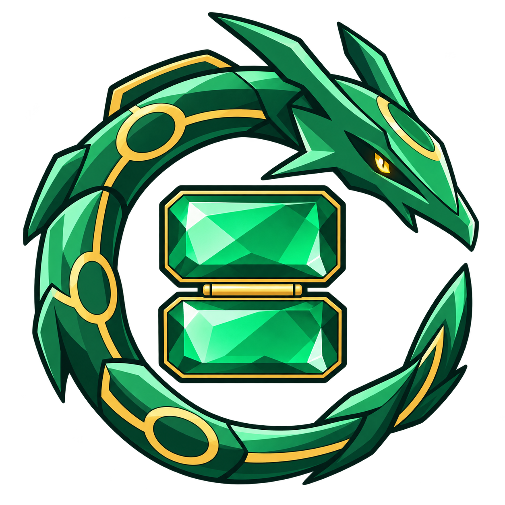
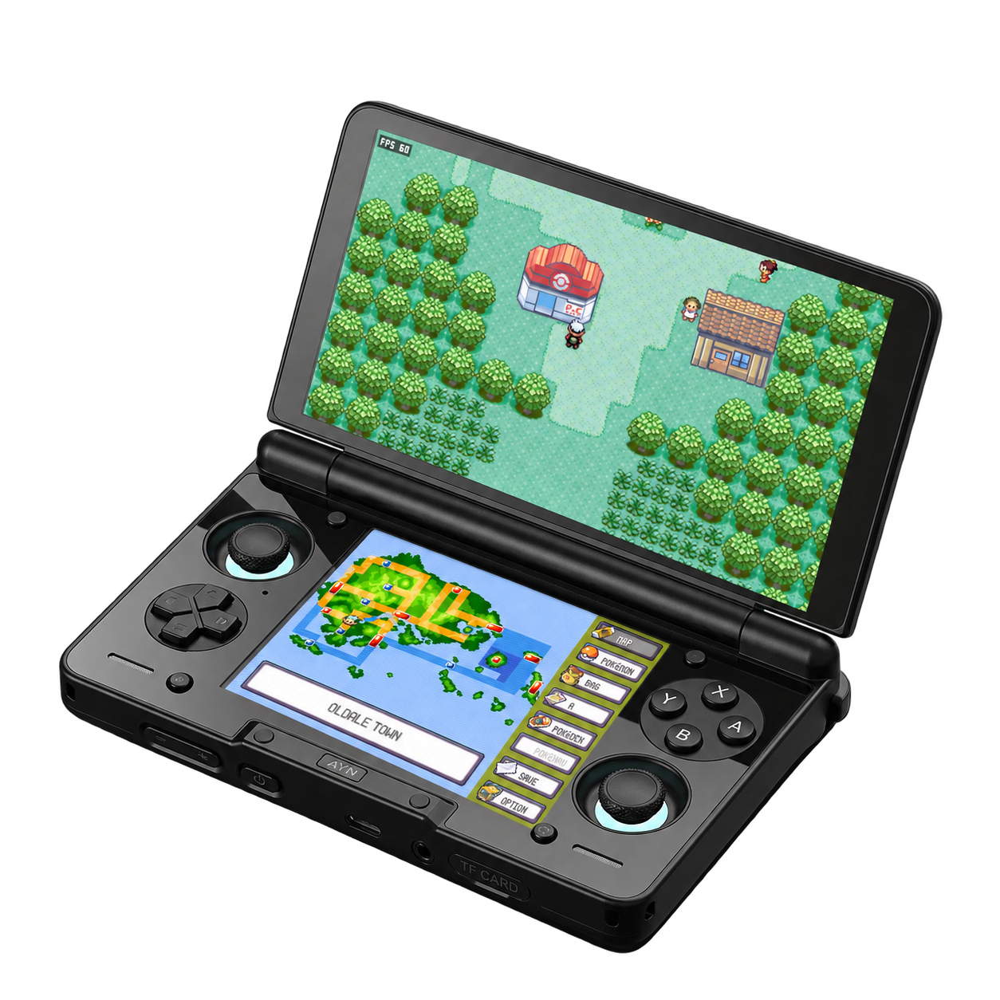
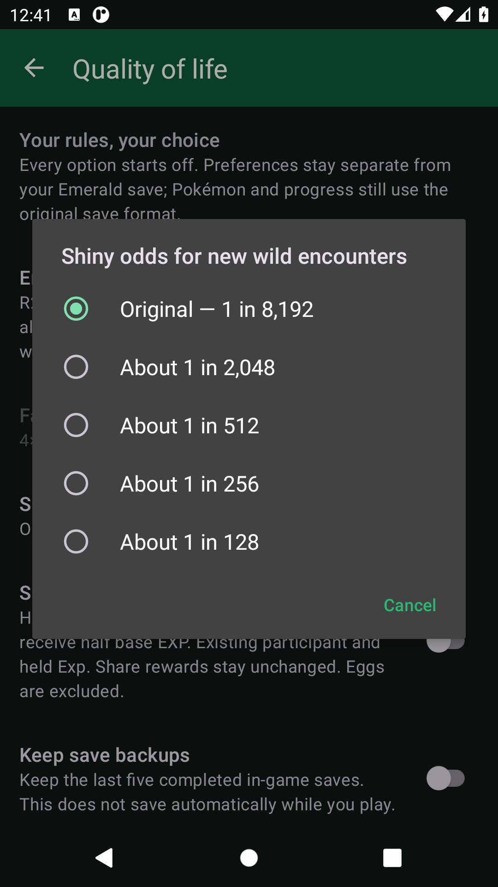
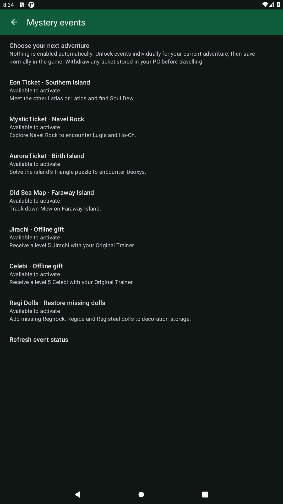
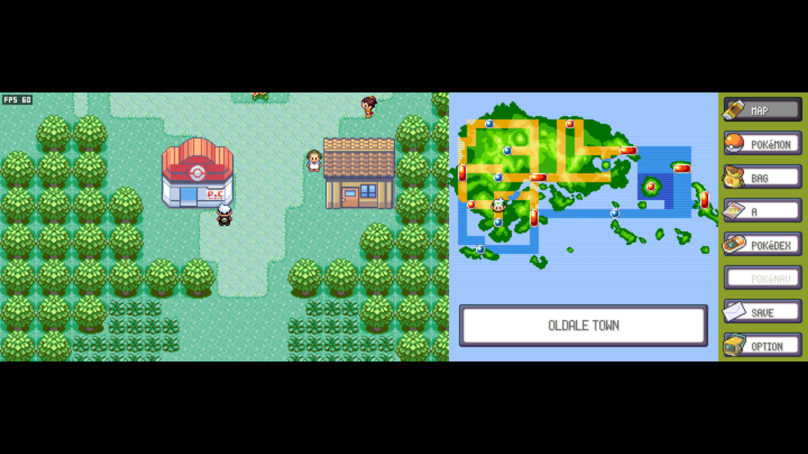
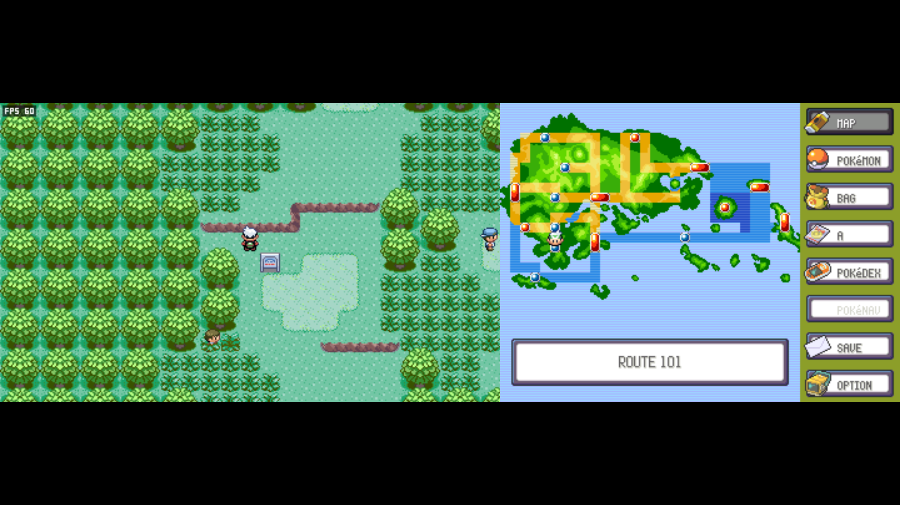
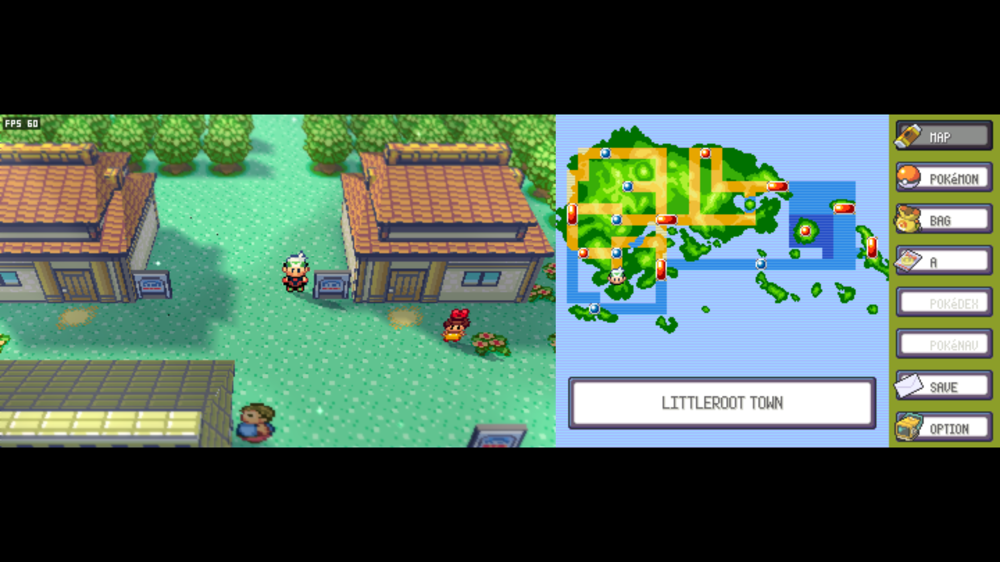
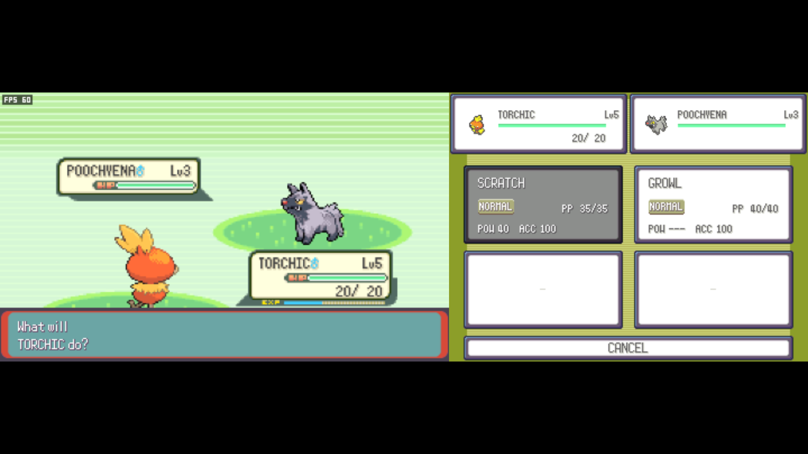
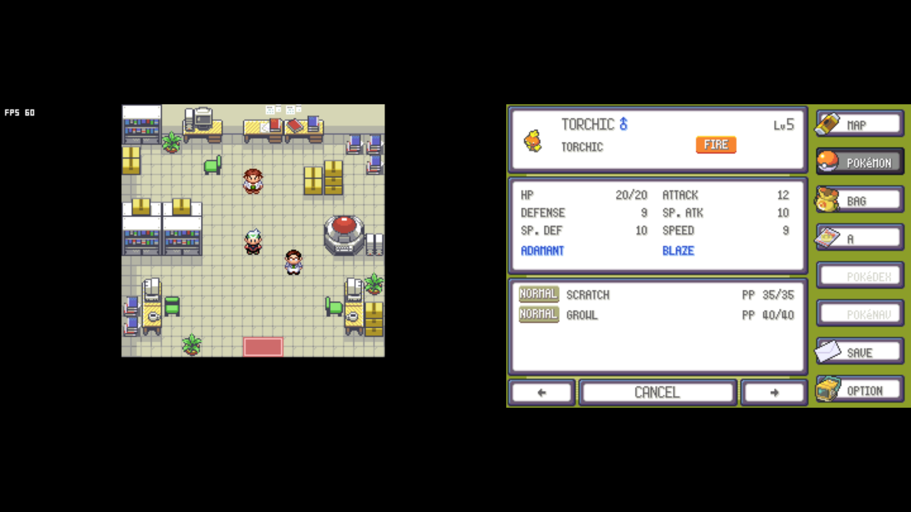

  

<h1 align="center">Pokémon Emerald Dual Screen</h1>

<strong>Emerald on Android. Built for two screens.</strong>

  Explore Hoenn with the game above, touch controls below, and an optional voxel overworld. 
  Designed for the AYN Thor, with layouts for phones and other Android handhelds.

  
  
  

  <a href="https://github.com/psspssr/pokeemerald-3Ds-dualscreen-thor/releases/tag/v0.1.0-alpha.7">Download Android preview</a> ·
  <a href="#get-started">Get started</a> ·
  <a href="#controls">Controls</a> ·
  <a href="docs/AYN_THOR.md">Thor setup</a>

  
   <em>Presentation mockup using emulator captures</em>
   Device reference: <a href="https://droix.net/wp-content/uploads/2025/08/AYN-THOR-BLACK-LISTING-DONE-01.png">DROIX</a> · <a href="docs/images/thor-presentation.json">Image provenance</a>

An Android port of [ZallaxDev's Pokémon Emerald 3Ds Dual Screen](https://github.com/ZallaxDev/pokeemerald-3Ds-dualscreen), built on [pret/pokeemerald](https://github.com/pret/pokeemerald).

## Get started

Download the signed **[0.1.0-alpha.7 Android preview](https://github.com/psspssr/pokeemerald-3Ds-dualscreen-thor/releases/tag/v0.1.0-alpha.7)** and install its `armeabi-v7a.apk`. Matching game data is included. Downloads currently require access to this private repository. Export your save before replacing a development APK, which uses a different signing key.

**Pause with L1 + R1 together** or keyboard **Escape**, then open **Settings**. On Thor, both panels fill by default without cropping; choose **Fit** to keep the original proportions. Phone layouts include on-screen controls. See [Thor setup](docs/AYN_THOR.md).

Use **Settings → Import save / Export save** to transfer Emerald `.sav` files, then restart after importing. Standard GBA/emulator saves and mGBA RTC trailers are supported; emulator save states are not. Save normally in the game to keep your progress. [Save details](docs/BUILDING.md#engine-only-build-and-data-packs).

## Compatibility

Requires **Android 9+, OpenGL ES 3.0 and 32-bit ARM app support** (`armeabi-v7a`). Firmware limited to 64-bit apps cannot run this build. **Physical Thor testing and sustained hardware performance remain open**; [test results](docs/VALIDATION.md) describe the emulator coverage and limits.

## Controls

Face buttons use Nintendo positions by default, regardless of their printed labels.

| Action | Controller | Keyboard |
|---|---|---|
| Move | D-pad / left stick | Arrow keys |
| A / B | Right / bottom face button | X / Z |
| X / Y | Top / left face button | S / A |
| L / R | L1 / R1 individually | Q / W |
| Start / Select | Start / Select | Enter / Backspace or Shift |
| App pause menu | **L1 + R1 together** | Escape |
| Fast-forward toggle / hold | R2 / L2 | Tab: hold |

Fast-forward requires enabling it and choosing **2× or 4×** in Settings. Touch the bottom screen for game menus. [Full controls sheet, display swapping and optional controls](docs/AYN_THOR.md#controls-and-shortcuts).

## Optional extras

**Settings → Gameplay → Quality of life** offers fast-forward, shared party EXP, five rotating save backups and shiny-escape confirmation. Five shiny-odds choices range from **Original (1 in 8,192)** to **1 in 128**. All extras start off. [Options and odds details](docs/QUALITY_OF_LIFE.md).

**Settings → Gameplay → Mystery events** offers event-island tickets, offline Jirachi/Celebi gifts and missing Regi dolls. Activate each separately, then save in-game; normal story requirements remain. [Events and prerequisites](docs/MYSTERY_EVENTS.md).

  
See the optional settings

  

    
    
  

## See it in action

  
   <em>Classic 2D Hoenn, with your map and menus always within reach.</em>

<table>
  <tr>
    <td width="50%"></td>
    <td width="50%"></td>
  </tr>
  <tr>
    <td align="center"><strong>The original 2D look</strong></td>
    <td align="center"><strong>Optional voxel overworld</strong> Toggle in OPTION → VOXEL 3D.</td>
  </tr>
  <tr>
    <td width="50%"></td>
    <td width="50%"></td>
  </tr>
  <tr>
    <td align="center"><strong>Touch battle commands</strong></td>
    <td align="center"><strong>Your party at a glance</strong></td>
  </tr>
</table>

Actual ARM Android game in an emulator; [capture details](docs/images/README.md) and [portrait phone view](docs/images/portrait-controls.png). The Thor image above is a presentation mockup, not a hardware test.

## Project guides

[Build and test](docs/BUILDING.md) · [Thor setup](docs/AYN_THOR.md) · [Validation](docs/VALIDATION.md) · [Upstream updates](docs/UPDATING_FROM_ORIGIN.md)

[Automatic releases](docs/RELEASING.md) · [Architecture](docs/ANDROID_ARCHITECTURE.md) · [Icon artwork](docs/ICON.md)

## Credits and licensing

- **ZallaxDev and contributors** — [Pokémon Emerald 3Ds Dual Screen](https://github.com/ZallaxDev/pokeemerald-3Ds-dualscreen), the upstream game port and touch interface. [Support the original project](https://ko-fi.com/zallax) · [Community](https://discord.com/invite/tfqHF8496P).
- **pret** — [pokeemerald](https://github.com/pret/pokeemerald), the Emerald decompilation used by the upstream engine.
- **gradenGnostic/pokeemerald-multiplatform contributors** — voxel logic adapted by the 3DS project; see its [attribution](origin/3ds_port/src/voxel/NOTICE.md).
- **devkitPro** — libctru, Citro3D and Citro2D interfaces; implementation and licence details are recorded in the relevant `THIRD_PARTY.md` files.

The Android port's original code is [MIT licensed](LICENSE). Imported projects retain their own terms; see [NOTICE.md](NOTICE.md) and [upstream provenance](origin/docs/PROVENANCE.md). The code licence does not grant rights to Pokémon game assets. Screenshots show the game running in the Android port.

This is an unofficial fan project, unaffiliated with Nintendo, Game Freak, Creatures or The Pokémon Company. Pokémon and Pokémon Emerald are their respective owners' trademarks.
