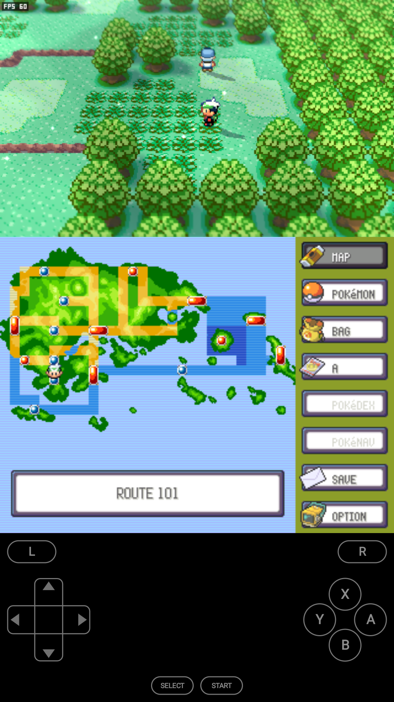
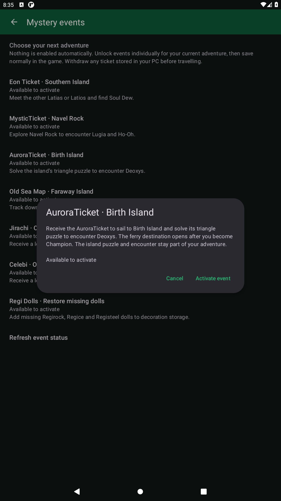

<p align="center">
  
</p>

<h1 align="center">Pokémon Emerald Dual Screen</h1>

<p align="center"><strong>Emerald on Android. Built for two screens.</strong></p>

<p align="center">
  Explore Hoenn with the game above, touch controls below, and an optional voxel overworld.<br>
  Designed for the AYN Thor, with layouts for phones and other Android handhelds.
</p>

<p align="center">
  <a href="https://github.com/psspssr/pokeemerald-3Ds-dualscreen-thor/actions/workflows/android.yml"></a>
  <a href="#compatibility"></a>
  <a href="LICENSE"></a>
</p>

<p align="center">
  <a href="https://github.com/psspssr/pokeemerald-3Ds-dualscreen-thor/releases/tag/v0.1.0-alpha.3">Download Android preview</a> ·
  <a href="#build-and-play">Build and play</a> ·
  <a href="docs/AYN_THOR.md">Thor setup</a> ·
  <a href="docs/VALIDATION.md">Test results</a> ·
  <a href="docs/UPDATING_FROM_ORIGIN.md">Upstream updates</a>
</p>

An Android port of [ZallaxDev's Pokémon Emerald 3Ds Dual Screen](https://github.com/ZallaxDev/pokeemerald-3Ds-dualscreen), built on [pret/pokeemerald](https://github.com/pret/pokeemerald). The upstream game, bottom-screen interface and voxel renderer are preserved; Android supplies the graphics, audio, storage and input support.

## See it in action

<p align="center">
  <a href="docs/images/classic-town.png"></a>
  <br><em>Classic 2D Hoenn, with your map and menus always within reach.</em>
</p>

<table>
  <tr>
    <td width="50%"><a href="docs/images/classic-route.png"></a></td>
    <td width="50%"><a href="docs/images/voxel-world.png"></a></td>
  </tr>
  <tr>
    <td align="center"><strong>The original 2D look</strong><br>Explore Hoenn with voxel rendering off.</td>
    <td align="center"><strong>An optional new perspective</strong><br>Switch the voxel overworld on in OPTION.</td>
  </tr>
  <tr>
    <td width="50%"><a href="docs/images/battle.png"></a></td>
    <td width="50%"><a href="docs/images/party-summary.png"></a></td>
  </tr>
  <tr>
    <td align="center"><strong>Touch battle commands</strong><br>Choose your next move on the bottom screen.</td>
    <td align="center"><strong>Your party at a glance</strong><br>View stats, abilities and moves beside the game.</td>
  </tr>
</table>

<sub>Actual ARM Android build, captured in an emulator with the combined landscape layout. Click an image for full resolution. [Screenshot details](docs/images/README.md).</sub>

<details>
  <summary><strong>See the portrait phone layout</strong></summary>
  <p align="center">
    <a href="docs/images/portrait-controls.png"></a>
    <br>Both screens and touch controls on one display.
  </p>
</details>

## Made for handheld play

| Feature | In the game |
|---|---|
| **Two displays** | A separate window for the bottom touch screen. Reverse display ordering in Settings, or fall back to a combined layout when the second display disconnects. |
| **Phones and tablets** | Portrait and landscape layouts, with on-screen controls for play on one display. |
| **Voxel overworld** | Switch between the original 2D presentation and upstream's voxel scenery through **OPTION → VOXEL 3D**. |
| **Touch menus** | Use the bottom screen for the map, party, bag, battle commands, save and options. |
| **Physical controls** | Gamepad and keyboard support, with a Nintendo-style positional layout by default and an alternative Xbox-style mapping. |
| **Portable saves** | Import and export standard Emerald `.sav` files. Keep Android and voxel preferences separately from your game progress. |
| **Optional quality of life** | 2×/4× fast-forward, boosted wild shiny odds, shared party EXP, rotating save backups and shiny-escape confirmation. Every option starts off. |
| **Mystery events** | Unlock the four event islands, receive offline Jirachi/Celebi gifts, or restore missing Regi dolls. Choose each action yourself. |

## Compatibility

The game requires **Android 9 or newer, OpenGL ES 3.0, and 32-bit ARM app support** (`armeabi-v7a`). The current game build does not run on devices whose firmware supports only 64-bit apps.

On a connected device, check:

```sh
adb shell getprop ro.product.cpu.abilist
```

The result must include `armeabi-v7a`. The AYN Thor is the primary design target; actual support depends on its firmware. See [Thor display and control setup](docs/AYN_THOR.md) for layout, scaling and device checks.

The real ARM game has been tested on an Android emulator through the opening sequence, starter selection, wild and rival battles, level-ups, captures, touch menus and save/load. Two-display touch, background/resume and display removal have also been exercised. **Physical Thor testing and sustained hardware performance measurements remain open.** The [validation report](docs/VALIDATION.md) records the tested build, evidence and coverage limits.

## Build and play

Download the signed **[0.1.0-alpha.3 Android preview](https://github.com/psspssr/pokeemerald-3Ds-dualscreen-thor/releases/tag/v0.1.0-alpha.3)** and install `emerald-thor-0.1.0-alpha.3-armeabi-v7a.apk` on a compatible device. This private preview includes matching game data and can start immediately. Downloads currently require access to this repository. If replacing a development APK, export your save first: release and debug signing keys differ.

To build from source:

Development happens on `main`. Start with the [Linux build prerequisites and Android SDK setup](docs/BUILDING.md#install-the-tools), then:

```sh
git clone https://github.com/psspssr/pokeemerald-3Ds-dualscreen-thor.git
cd pokeemerald-3Ds-dualscreen-thor
python3 tools/bootstrap.py --make --apk -j4
```

Install the resulting development APK on a compatible device:

```sh
adb install -r android/app/build/outputs/apk/debug/emerald3ds-android-debug.apk
```

The build fetches the pinned upstream engine, generates its data, compiles the Android port and packages the app. Pushes and pull requests run validation; publishing a GitHub release triggers the separate signed-APK workflow. Engine-only packaging and matching data packs are covered in the [build guide](docs/BUILDING.md#engine-only-build-and-data-packs).

## Bring your save

Use **Settings → Import save** to bring in an Emerald battery/flash save, then restart the game. Use **Export save** to take your progress back to a GBA emulator.

Game-created saves use the standard **128 KiB raw `.sav` format**, with no Android header. Real saves have been transferred between this port and the original GBA game running in mGBA. The importer also handles mGBA's optional RTC trailer; emulator save states are a different format and are not supported. [Save formats and transfer details →](docs/BUILDING.md#engine-only-build-and-data-packs)

## Choose your quality-of-life options

Open **Settings → Gameplay → Quality of life**. Fast-forward has a **2× / 4×** selector; once enabled, **R2 toggles** it and **L2 holds** it. Keyboard Tab and the pause menu are available too. Audio is muted while accelerating.

Shiny-odds boosts affect new ordinary wild encounters, shared EXP rewards eligible benched Pokémon, and optional backups retain five completed in-game saves. A separate switch asks for confirmation before fleeing a shiny. All features are disabled by default and keep the GBA save format intact. [Behavior and safeguards →](docs/QUALITY_OF_LIFE.md)

## Choose your Mystery events

Open **Settings → Gameplay → Mystery events** to inspect an event and activate it individually. The menu checks your current adventure and shows whether each option is available, already unlocked or completed. Nothing is granted automatically.

| Option | What it unlocks |
|---|---|
| **Eon Ticket** | Southern Island: the other Latias/Latios and Soul Dew. |
| **Mystic Ticket** | Navel Rock: Lugia and Ho-Oh. |
| **Aurora Ticket** | Birth Island: Deoxys and its triangle puzzle. |
| **Old Sea Map** | Faraway Island: Mew and its hide-and-seek encounter. |
| **Jirachi / Celebi gifts** | Level-5 Pokémon with your Original Trainer, delivered to an empty party slot. |
| **Regi Doll set** | Missing Regirock, Regice and Registeel decorations. |

<table>
  <tr>
    <td width="50%" align="center"><a href="docs/images/mystery-events.png"></a></td>
    <td width="50%" align="center"><a href="docs/images/mystery-deoxys.png"></a></td>
  </tr>
  <tr>
    <td align="center"><strong>Pick an event</strong><br>See the options and your current progress.</td>
    <td align="center"><strong>Activate when ready</strong><br>Read the requirements before changing your adventure.</td>
  </tr>
</table>

Use a saved adventure with the Pokédex and stand still in the overworld. After activation, **save normally in the game**. Island travel retains the original Champion/ferry requirements, puzzles and encounter progress. Jirachi/Celebi are offline gifts; missing dolls may be restored again after deletion or trading. [Full behavior and save compatibility →](docs/MYSTERY_EVENTS.md) · [Screenshot provenance](docs/images/mystery-events-captures.json)

## Follow upstream

The original 3DS project is kept unchanged in [`origin/`](origin/), with its exact revision recorded in [`origin.lock`](origin.lock). Android changes live outside that tree; small tracked overlays are applied only to the generated build for optional gameplay hooks and visual fixes.

Preview an update:

```sh
python3 tools/sync_origin.py --dry-run
```

From a clean checkout, import and rebuild:

```sh
python3 tools/sync_origin.py && python3 tools/bootstrap.py --make --apk -j4
```

The updater checks source integrity and reports newly required 3DS APIs. New upstream revisions still need build and gameplay validation. See the [update guide](docs/UPDATING_FROM_ORIGIN.md) for version selection, safeguards and the acceptance checklist.

## Automated APK releases

Publishing a new GitHub release with a tag such as `v0.1.0-alpha.3` starts the release workflow. It runs validation, builds and signs the playable ARMv7 APK, and attaches it with checksums and a build manifest. The app version follows the tag; its Android build number increases automatically. Ordinary pushes, pull requests, draft releases and tag pushes do not publish APKs. [Release setup and retry guide →](docs/RELEASING.md)

## Project guides

| Guide | Details |
|---|---|
| [Build and test](docs/BUILDING.md) | Toolchain setup, APKs, data packs, saves and emulator tests. |
| [Release an APK](docs/RELEASING.md) | Stable signing, exact-artifact testing and verified GitHub uploads. |
| [AYN Thor](docs/AYN_THOR.md) | Display routing, scaling, controls and hardware checks. |
| [Quality of life](docs/QUALITY_OF_LIFE.md) | Opt-in speed, shiny odds, party EXP, backup and encounter settings. |
| [Mystery events](docs/MYSTERY_EVENTS.md) | Event islands, offline gifts, decorations and existing-progress checks. |
| [Validation](docs/VALIDATION.md) | Real-game results, save interchange and performance measurements. |
| [Architecture](docs/ANDROID_ARCHITECTURE.md) | How the 3DS engine runs on Android. |
| [Update upstream](docs/UPDATING_FROM_ORIGIN.md) | Preview, import and validate new versions. |
| [Icon artwork](docs/ICON.md) | The launcher artwork and its generation provenance. |

## Credits and licensing

- **ZallaxDev and contributors** — [Pokémon Emerald 3Ds Dual Screen](https://github.com/ZallaxDev/pokeemerald-3Ds-dualscreen), the upstream game port and touch interface. [Support the original project](https://ko-fi.com/zallax) · [Community](https://discord.com/invite/tfqHF8496P).
- **pret** — [pokeemerald](https://github.com/pret/pokeemerald), the Emerald decompilation used by the upstream engine.
- **gradenGnostic/pokeemerald-multiplatform contributors** — voxel logic adapted by the 3DS project; see its [attribution](origin/3ds_port/src/voxel/NOTICE.md).
- **devkitPro** — libctru, Citro3D and Citro2D interfaces; implementation and licence details are recorded in the relevant `THIRD_PARTY.md` files.

The Android port's original code is [MIT licensed](LICENSE). Imported projects retain their own terms; see [NOTICE.md](NOTICE.md) and [upstream provenance](origin/docs/PROVENANCE.md). The code licence does not grant rights to Pokémon game assets. Screenshots show the game running in the Android port.

This is an unofficial fan project, unaffiliated with Nintendo, Game Freak, Creatures or The Pokémon Company. Pokémon and Pokémon Emerald are their respective owners' trademarks.
